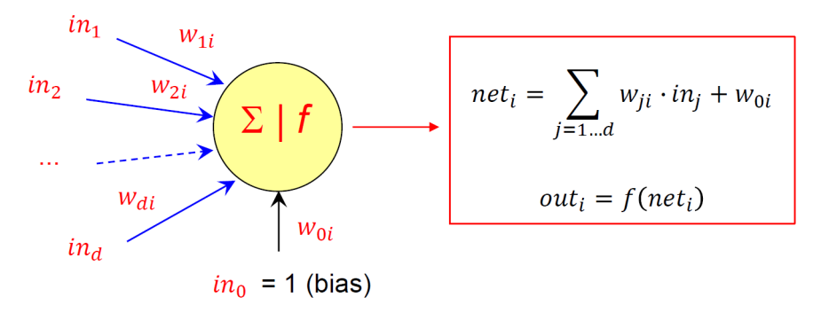
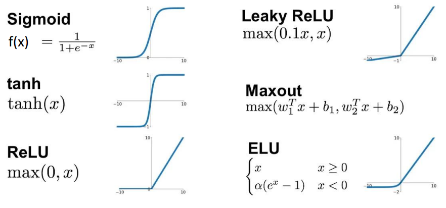
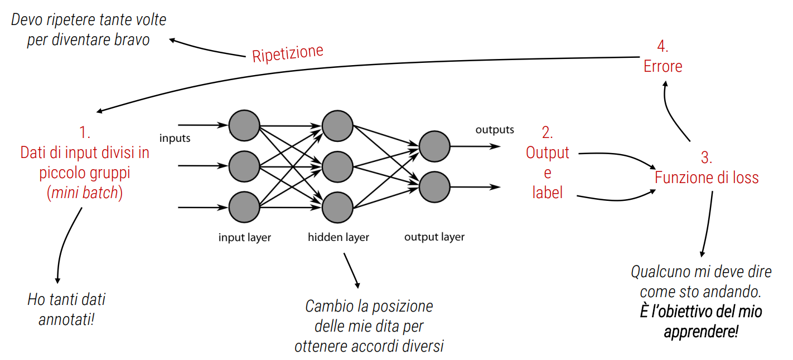
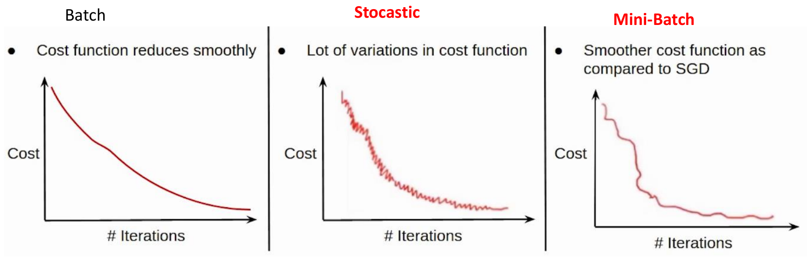

# Intelligenza artificiale

## Intelligenza artificiale, Machine Learning, Deep Learning

Con intelligenza artificiale intendiamo la **riproduzione parziale dell'attivita'
intellettuale propria dell'uomo** (con particolare riguardo ai processi di
apprendimento, riconoscimento e scelta) realizzata attraverso l'elaborazione
di modelli ideali, o ,concretamente, con la messa a punto di **macchine**
che utilizzano per lo piu' a tale fine elaboratori elettronici.

L'intelligenza artificiale e' una disciplina molto vasta che copre
diverse tematiche. Una di queste e' il Machine Learning, in cui la macchina
impara "da sola", cioe' senza una programmazione esplicita, a risolvere
problemi. Per imparare usa una collezione di
dati. Il Deep Learning e' un sottoinsieme del machine learning, che
utilizza le reti neurali per analizzare diversi fattori con una struttura
simile al sistema neurale umano.

## Storia AI

- 1940 - 1974:
  - Primi calcolatori elettronici in epoca seconda guerra mondiale
  - Teoria della computazione di Turing e Test di Turing "Can machines think?" 1950
  - Teoria dell'informazione di Shannon
  - Primo modello di neurone artificiale McCulloch and Pitts 1943
  - Nascita ufficiale e conio del nome al Dartmouth Workshop 1956
  - Grande entusiasmo e predizioni troppo ottimistiche
- Primo inverno 1970-1980:
  - Risultati non all'altezza delle aspettative, drastica riduzione dei finanziamenti
  - Problemi: scarsa capacita' computazionale, esplosione combinatoria e non trattabilita', data set di piccole dimensioni
  - Ridimensionamento dell'approccio connessionistico (reti neurali)
- 1980 - 1987 Nuova primavera:
  - Nacita dei sistemi esperti (Expert Systems): conoscenza + regole logiche
  - Nuova linfa alle reti neurali dall'algoritmo Backpropagation 1986
  - Finanziamento goveno giapponese per la Quinta Generazione dei Calcolatori
- Secondo inverno mid 1987 - 1993s:
  - Flop "Quinta Generazione". Nuovo stop ai finanziamenti
  - Risultati concreti dei sistemi esperti solo in campi specifici. Reti neurali non scalano a problemi complessi
- 1993 - 2011 Tempi moderni:
  - Hardware sempre piu' potente (prima GPU Nvidia 1999)
  - Raccolta di grandi qta' di dati (Big Data) sempre piu' semplice e meno costosa
  - Recupero delle formulazioni matematiche degli anni precedenti (backpropagation)
  - Rinascita del Deep Learning (successi in visione, sistemi biometrici, riconoscimento vocale, robotica, guida autonoma, diagnosi mediche)
- Oggi 3 possibilita':
    1. Terzo inverno
    2. Progresso incrementale
    3. Breccia in AGI (Immaginazione artificiale?)

## Paradigma AI

1. **Acquisizione dati**: i dati sono l'elemento fondante di qualsiasi applicazione correlata al Machine Learning. L'acquisizione di grandi quantita' di dati e' oggi uno degli obiettivi principali delle grandi aziende.
2. **Data processing**: tutte quelle tecniche con cui vengono elaborati i dati per adattarli al meglio al modello ML che si intende sviluppare.
3. **Modello**: e' il nucleo principale del sistema AI. Un modello puo' essere visto come un insieme di tecniche matematiche e statistiche, in grado di apprendere da una certa distribuzione di dati forniti in input e di generalizzare su nuovi dati.
4. **Predizione**: l'output del modello puo' assumere molte forme a seconda dell'applicazione sviluppata. E' importante valutare l'efficacia del sistema sviluppato con appropriate metriche.

### Acquisizione dei dati

L'acquisizione dei dati e' il primo passo nello sviluppo di un sistema ML.
E' possibile ottenere dati principalmente in due modi:

1. Usare set di dati o database di dati pubblicamente disponibili. Pubblicare i propri set di dati e' una prativc consilidata nel mondo della ricerca (affinche' altri possano condurre gli stessi esperimenti, magari proponendo soluzioni migliori). E' la base del metodo scientifico, in particolare per la riproducibilita' dei risultati ottenuti.
2. Acquisendo un nuovo set di dati

#### Annotazione dei dati

**Non basta acquisire i dati**, serve anche un'operazione solitamente
chiamata "annotazione" (o etichettatura). L'etichetta (*label*)
rappresenta il contenuto (semantico) dei dati e dipende dal problema che
vogliamo risolvere e puo' essere **numerica** o **categorica**.

- Se abbiamo dati annotati siamo in un contesto di **learning supervisionato (supervised learning)**.
- Se non abbiamo dati annotati siamo in un contesto di **learning non supervisionato (unsupervised learning)**.
  - L'algoritmo deve imparare a riconoscere pattern nell'input senza che sia data nessuna indicaziozne specifica dei valori in uscita.
  - Lo scopo e' quello di apprendere in autonomia la struttura che possiedono i dati in ingresso.

L'apprendimento non supervisionato e' usato per gestire problemi di
clustering andando a trovare gruppi di dati in base alle caratteristiche
che hanno in comune.
Esiste anche l'apprendimento **semi-supervisionato (semi-suprvised learning)**,
se i dati di input sono una miscela di campioni etichettati e non. Si
combinano le caratteristiche dell'apprendimento supervisionato e non supervisionato. Questo approccio non e' sempre praticabile.

#### Organizzazione dei dati

Una volta ottenuti i dati raccoolti per il sistema ML, e' necessario
organizzarli come segue:

- **Training set**: i dati sui quali il modello apprende autonomamente durante la fasi di apprendimento.
- **Validation set**: parte del training set. Su questi dati vendono messi a punto gli iperparametri.
- **Testing set**: dati su cui il modello viene testato durante la fase di test.

### Task

Ci sono diversi task in ML a seconda dell'output che vogliamo:

- Classificazione
- Regressione
- Clustering

#### Classificazione

Dato un input specifico, il modello (**classificatore**) emette una classe

- Se ci sono $2$ classi chiamiamo il problema **classificazione binaria**
- Se ci sono piu' di $2$ classi chiamiamo il problema **classificazione multiclasse**.

Cos'e' una classe (output dell'attivita' di classificazione)?

- Un set di dati con propieta' comuni
- Il concetto di classe e' correlato al concetto di "etichetta"

Esempi di classificazione sono:

- Rilevamento spam
- Riconoscimento facciale
- Diagnosi medica

#### Regressione

La regressione viene utilizzata per modellare tra le variabili indipendenti e la variabile dipendente, in modo da poter fare previsioni su nuovi dati.

Dato uno specifico input, il modello (**regressore**) restituisce un valore continuo (non una classe).

Esempi:

- Stima dell'altezza di una persona in base al peso
- Stima dei prezzi di vendita degli appartamenti
- Stima del rischio per le compagnie assicurative

#### Clustering

Identificare gruppi (cluster) di dati con caratteristiche simili

Il clustering e' spesso applicato in un ambiente di **apprendimento non supervisionato**.
Di solito la natura non supervisionata del problema lo rende piu' complesso rispetto alla classificazione.
Spesso anche il numero di cluster non e' noto a priori.
I cluster identificati possono essere usati come classi.

Esempi:

- Definizione di gruppi di utenti basati sul consumo nel marketing
- Raggruppamento di individui in base alle analogie del DNA nella genetica

## Neuroni artificiali

### Neurone biologico

Composto da 4 parti:

- Corpo cellulare o **soma**
- Le estensioni delle cellule, **dendriti**
- Un'ulteriore estensione, **assone**
- Le **sinapsi**

I **dendriti** ricevono (input) segnali elettrici e chimici dagli altri neuroni e li trasmettono al **soma**.

Il **soma** elabora i segnali in ingresso nel tempo e converte il valore elaborato in un output.

L'**assone** trasmette il segnale elettrico dal soma ad altri neuroni o a cellule muscolari o ghiandolari.

All'estremita' dell'assone ci sono le **sinapsi**, che collegano il neurone ad altri neuroni per trasmette il segnale in uscita (output).

Quando il **soma** riceve i segnali in ingresso dai dendriti, esegue una
"elaborazione". **Se i segnali ricevuti superano una certa soglia**, viene
prodotto un nuovo segnale di uscita sull'assone. Questo segnale si propaghera'
ad altri neuroni, anche molto distanti tra loro.\

Il valore di questa soglia e l'efficenza di trasmissione elettrochimica
delle sinapsi sono strettamente legate ai processi di apprendimento.

### Neurone artificiali

Formulazione matematica del neurone artificiale del 1943, idea della
possibilita' di addestrarlo in base all'errore dell'output.

$$net_i = \sum^d_{j=1}w_{ji}\ in_j + w_{0i}$$
$$out_i = f(net_i)$$

$in_1,\ in_2,\ \dots,\ in_d$ sono i $d$ ingressi che il neurone $i$ riceve
da assoni di neuroni afferenti.

$w_1,\ w_2,\ \dots,\ w_d$ sono i pesi (weight) che determinano
l'efficacia delle connessioni sinaptiche dei dentriti
(agiremo su questi valori durante l'addestramento), l'importanza dell'input i-esimo sull'output.

$w_{0i}$ (detto **bias**) e' un ulteriore peso che si considera collegato
a un input fittizio con valore sempre $1$ questo peso e' utile per tarare
il punto di lavoro ottimale del neurone.

$f()$ e' la **funzione di attivazione** simula il comportamento del
neurone biologico di attivarsi solo se i segnali in ingresso
**superano una certa soglia**. E' una sorta di **interruttore** della
cellula.

#### Funzioni di attivazione

Una funzione di attivazione determina se un neurone deve essere **attivato o meno**.
Si tratta di alcune semplici **operazioni matematiche** per determinare
se l'input del neurone alla rete e' rilevante o meno nel processo di previsione.

Le funzioni di attivazione possono essere di diversi tipi, ma in generale
devono essere **non lineari** per consentire alla rete di apprendere
relazioni complesse tra le sue variabili di input, e **derivabili**.

### MLP

Per poter avere separazioni piu' complicate rispetto a quelle lineari:

La soluzione e' utilizzare piu' neuroni artificiali organizzati su diversi (tanti) strati (layer) **Multilayer Perception (MLP)**.

### Tipologie di reti neurali

Le reti neurali sono composte da gruppi di neuroni artificiali organizzati in **livelli**.
Tipicamente sono presenti un livello di **input**, un livello di
**output**, e uno o piu' **livelli intermedi**.
Ogni livello contiene uno o piu' neuroni. I layer intermedi sono chiamati
hidden layers in quanto restano "invisibili" dall'esterno della rete, la
quale si interfaccia all'ambiente solo tramite il layer di ingresso e
quello di uscita.

#### Feedforward (FFNN)

Nelle reti **feedforward** le connessioni collegano i neuroni di un livello
con i neuroni di un livello successivo. **Non** sono consentite
connessioni all'indietro o connessioni verso lo stesso livello.\
E' il tipo di rete piu' utilizzata.

#### Ricorrenti

Sono previste connessioni di **feedback**, in genere verso **neuroni
dello stesso livello**, ma anche all'indietro.
Questo tipo di rete crea una sorta di **memoria** di quanto accaduto in
passato e rende quindi l'uscita attuale **non solo dipendente dall'
ingresso attuale,** ma anche da tutti gli **ingressi precedenti**.

## Addestramento di una rete

Come facciamo a capire in automatico se sto **incrementando** o
**diminuendo** l'errore? Quindi se mi sto avvicinando o allontanando
dalla soluzione desiderata?

Il mio obiettivo e' una **funzione**, calcolo la **derivata** di questa
funzione e capisco da che parte sto andando.

Per una rete neurale apprendere equivale a minimizzare la funzione di loss.

### Discesa del gradiente

Fissata la topologia (numero di livelli e neuroni), l'addestramento di una
rete neurale consiste nel determinare il valore dei pesi $w$ che determinano
il **mapping desiderato** tra input e output.

Passo dopo passo, tramite la **discesa del gradiente**, mi avvicino
all'obiettivo.

### Training di una rete neurale

- I dati di addestramento vengono presentati alla rete (**forward**)
- I pesi vengono aggiustati (**backward**) sulla base di quanto sono simili i valori restituiti dalla rete rispetto a quelli desiderati (**loss**)
- Dopo che tutti i casi sono stati presentati, il processo ricomincia da capo (un altra epoca)

**Epoca**: l'intero set di addestramento viene passato attraverso il modello,
vengono eseguite la propagazione in avanti e la propaazione all'indietro e
i parametri vengono aggiornati.

#### Forward propagation

Con forward propagation (o inference) si intende la propagazione delle informazioni in avanti dal livello di input a quello di output.

Una volta addestrata, una rete neurale puo' semplicemente processare pattern attraverso forward propagation.

#### Loss function

Sia $\hat{y} = [\hat{y}_1,\dots,\hat{y}_s]$ l'output prodotto dalla rete
in corrispondenza all'esempio di training $x = [x_1,\dots,x_d]$ e sia $y = [y_1,\dots,y_s]$ il vettore delle etichette corrispondente dell'esempio di training.

Segliamo come loss function la somma dei quadrati degli errori tra l'output
della rete e la corrispondente etichetta:
$$L(y,\hat{y}) = \frac{1}{2}\sum^s_{i=1}(y_i-\hat{y}_i(w))^2 = \frac{1}{2}\|y - \hat{y}(w)\|^2_2$$
Dove $w = \{w^{(1)},\dots,w^{(l)}\}$ dove $w^{(j)}$ rappresenta l'insieme
dei pesi al layer j-esimo.

### Metodo di backpropagation

E' legato alla tecnica utilizzata per il calcolo delle derivate della
funzione di errore, basata sulle regole di derivazione delle funzioni composte.

Per calcolare il vettore dei pesi:
$$w^*=\{w^{(1)},\dots,w^{(j)}\}\in \text{argmin C}(w) = \frac{1}{n_T}\sum^{n_T}_{j=1}L(y^{(j)}, \hat{y}^{(j)})$$
ricorriamo al metodo del gradiente
$$w^{(k)} = w^{(k-1)}-\eta \nabla C(w^{(k-1)})$$
dove $\eta$ rappresenta lo step-size, che in questo contesto prende il nome di **learning rate**.

Dobbiamo quindi calcolare $\nabla C(w)$

Introduciamo la procedura di calcolo del gradiente mediante **backpropagation**.

Vogliamo calcolare
$$
\nabla L =
\begin{bmatrix}
  \frac{\partial L}{\partial w^{(1)}_{11}} \\
  \\
  \frac{\partial L}{\partial  w^{(2)}_{11}} \\
  \\
  \frac{\partial L}{\partial w^{(3)}_{11}}
\end{bmatrix}
$$

Poniamo
$$
\begin{matrix}
\delta_1^{(3)} = \frac{\partial L}{\partial \hat{y}_1} f'(a^{(3)}_1) \\
\\
\delta_1^{(2)} = \delta_1^{(3)} w^{(3)}_{11} f'(a^{(2)}_1) \\
\\
\delta^{(1)}_1 = \delta^{(2)}_1 w^{(2)}_{11} f'(a^{(1)}_1)
\end{matrix}
$$

Le formule del gradente della loss function $L$ rispetto a tutti i pesi
$\{w^{(1)}_{11},w^{(2)}_{11},w^{(3)}_{11},\}$ si potranno esprimere come:
$$
\begin{matrix}
  \frac{\partial L}{\partial w^{(1)}_{11}} = \delta^{(3)}_1 \text{z}^{(2)}_1 \\
  \\
  \frac{\partial L}{\partial  w^{(2)}_{11}} = \delta^{(2)}_1 \text{z}^{(1)}_1 \\
  \\
  \frac{\partial L}{\partial w^{(3)}_{11}} = \delta^{(1)}_1 \text{z}^{(0)}_1
\end{matrix}
$$

Aggiornameto dei pesi per l'epoca successiva:
$$
\begin{matrix}
w^{(3)}_{11} = w^{(3)}_{11} - \eta \delta^{(3)}_1 \text{z}^{(2)}_1 \\
w^{(2)}_{11} = w^{(2)}_{11} - \eta \delta^{(2)}_1 \text{z}^{(1)}_1 \\
w^{(1)}_{11} = w^{(1)}_{11} - \eta \delta^{(1)}_1 \text{x}_1\\
\end{matrix}
$$

### Batch Gradient Descent

Per il calcolo della funzione costo $C(w)$ vengono usati gli $n_T$ campioni
del training set.
$$T = \{(x^{(j)}, y^{(j)})\lvert x^{(j)}\in \mathbb{R}^d, y^{(j)}\in \mathbb{R}^s,\ j=1,\dots,n_T \}$$
$$ w^*\in \text{arg min}_w \{C(w)=\frac{1}{n_T}\sum^{n_T}_{j=1}L(y^{(j)},\hat{y}^{(j)})\} $$
Quindi:

- Si considera l'intero set di addestramento
- Si esegue la Forward Propagation e si calcola la funzione di costo
- Si aggiornano i parametri usando il tasso di variazione di questa funzione di costo ripsetto ai parametri

**Epoca**: l'intero set di addestramento vinene passato attraverso il modello,
vengono eseguite la propagazione in avanti e la propagazione all'indietro
e i parametri vengono aggiornati.

Nel batch gradient descent poiche' stiamo utilizzando l'intero set di
addestramento, i parametri verranno aggiornati solo una volta per epoca.

### Discesa del gradiente stocastico (SGD)

Se si utilizza una singola osservazione per calcolare la funzione di costo,
si parla di **Stochastic Gradient Descent**, comunemente abbreviato SGD.
Passiamo una sola osservazione alla volta, calcoliamo il costo e aggiorniamo
i parametri.

Ogni aggiornameto dei parametri viene chiamato **iterazione**. Quindi abbiamo
$n_T$ iterazioni per epoca, dove $n_T$ e' il numero di osservazioni nel
dataset di training.

### Mini-batch Stocastic Gradient Descent

Per calcolare la funzione di costo si considera un sottoinsieme dell'intero
set di dati. Quindi, se ci sono $n_T$ osservazioni, il numero di osservazioni
in ciascun sottoinsieme o mini-batch sara' maggiore di $1$ e minore di $n_T$.

### Confronto tra Batch GD, SGD, e Mini-batch SGD

Numero di osservazioni utilizzate per l'aggiornameto:

- In Batch Gradient Descent:
  - Prendiamo l'intero set di dati
  - Calcoliamo la funzione di costo
  - Aggiorniamo i parametri
- In SGD:
  - Aggiorniamo i parametri dopo ogni singola osservazione
  - Ogni volta che i pesi vengono aggiornati si parla di iterazione
- In Mini-batch SDG:
  - Prendiamo un sottoinsieme di dati e aggiorniamo i parametri in base a ogni sottoinsieme

Funzioni di costo:

Poiche' in Batch GD aggiorniamo i parametri utilizzando l'intero set di dati
la funzione costo si aggiorna uniformemente.
Questo aggiornameto nel caso di SGD non e' cosi' fluido poiche' aggiornando
i parametri sulla base di una singola osservazione, ci sono molte iterazioni.
Potrebbe anche essere possibile che il modello inizi ad apprendere anche il rumore.
L'aggiornamento della funzione di costo nel caso di Mini-batch Gradient Descent e'
piu' fluido rispetto a quello della funzione di costo in SGD. Dal momento
che non aggiorniamo i parametri dopo ogni singola osservazione ma dopo ogni
sottoinsieme dei dati.

Poiché dobbiamo caricare l'intero set di dati alla volta, eseguire la propagazione in avanti su di esso e
calcolare l'errore e quindi aggiornare i parametri, nel caso Batch Gradient Descent il costo di calcolo è
molto elevato.

Il tempo di calcolo della funzione costo nel caso di SGD è inferiore rispetto a Batch Gradient Descent poiché
dobbiamo caricare ogni singola osservazione alla volta, ma il tempo di calcolo qui aumenta poiché ci sarà
un numero maggiore di aggiornamenti che si tradurrà in un numero maggiore di iterazioni .

Nel caso di Mini-batch Stocastic Gradient Descent, prendendo un sottoinsieme dei dati ci sono un numero
minore di iterazioni o aggiornamenti e quindi il tempo di calcolo nel caso di mini-batch Gradient Descent è
inferiore a SGD. Inoltre, poiché non stiamo caricando l'intero set di dati alla volta mentre carichiamo un sottoinsieme dei
dati, anche il tempo di calcolo della funzione costo è inferiore rispetto alla discesa del gradiente batch.
Questo è il motivo per cui **di solito si preferisce utilizzare il Mini-batch Stocatic Gradient Descent**.

#### Iperparametri

Sono parametri esterni al modello di machine learning che devono essere
impostati prima dell'avvio del processo di addestramento. A differenza dei
parametri del modeloo, che vendolo appresi durante l'addestramento stesso,
gli iperparametri influenzano il comportamento del processo di addestramento
e la configurazione del modello.

Gli iperparametri determinano come avviene l'addestramento del modello e
possono includere:

1. Learning rate: Determina quanto velocemente o lentamete il modello si adatta ai dati
2. Numero di epoche: il numero di volte in cui l'intero set di dati di addestramento vine utilizzato per addestrare il modello
Un numero insufficiente di epoche puo' portare a un modello non addestrato
adeguatamente, mentre un numero eccessivo di epoche puo' portare a un overfitting.
3. Dimensione del mini-batch: il numero di esempi di addestramento utilizzati
in ciascuna iterazione dell'algorini di ottimizzazione. La dimensione del
mini-batch puo' influenzare la velocita' di apprendimento e la stabilita'
dell'addestramento.
4. Architettura del modello: la struttura del modello, inclusi il numero
di strati, il numero di unita' in ciascun strato e le connessioni tra
gli strati. La scelta dell'architettura dipende dal problema e dai dati
specifici.
5. Regolarizzazione: i parametri che controllano la regolarizzazione del
modello, come il peso della regolarizzazione L1 o L2, influenzano la
complessita' del modello e la tendenza all'overfitting.
6. Inizializzazione dei pesi: il metodo utilizzato per inizializzare i pesi
del modello. Una buona inizializzazione puo' favorire una convergenza piu'
rapida e una migliore performance.
7. Funzione di attivazione: utilizzata per calcolare l'output di un unita'
nel modello. Le funzioni di attivazione comuni includono ReLU, sigmoid e tanh.

La scelta corretta degli iperparametri può influenzare significativamente le prestazioni del modello. Spesso,
gli iperparametri vengono regolati attraverso tentativi ed errori, eseguendo iterazioni multiple di
addestramento e valutando le prestazioni su un set di dati di validazione. L'esperienza, la conoscenza del
dominio e le best practice possono guidare la scelta degli iperparametri ottimali per un determinato
problema di machine learning.

#### Ottimizzazioni

Abbiamo visto che il GD aggiorna i parametri con
$$ w_{k+1} = w_k - \eta \nabla C(w_k) $$
$w$ e' il vettore dei parametri e $\eta$ e' il learing rate.

**La discesa del gradiente trova il minimo globale se la funzione e' convessa**,
sfortunatamente, quasi tutti **i problemi di ottimizzazione che sorgono
nell'allenamento di reti neurali sono non convessi**. Quindi sono presenti
minimi locali.

**Importanza del learning rate**:

**Valori bassi** di $\eta$ possono far si che sia necessario un numero elevato
di passi prima che l'allenamento sia completato, e che i pesi rimangano
bloccati in un minimo locale.

**Valori alti** di $\eta$ permettono di mitigare questi problemi passando oltre
i minimi locali e raggiungendo il minimo in numero limitato di passi, ma
possono anche superare il minimo target.

E' quindi necessaria molta sperimentazione per scoprire quale puo' essere
il valore ottimale del learning rate.

#### Gradient Descent con Momentum

L'aggiornameto dei parametri durante la discesa del gradiente puo' essere
lento e presentare oscillazioni, soprattutto per funzioni di costo con
curvature dolci o valli poco profonde.

**Momentum** e' una tecnica utilizzata per accelerare la convergenza e
ridurre le oscillazioni durante l'allenamento con Gradient Descent.

Formula di aggiornameto dei pesi:
$$ w_{k+1} = w_k - \eta v_k $$
dove $v_k = \beta v_{k-1} + \nabla C(w_k)$, $\beta$ prende il nome di
**momentum** e puo' variare tra $0$ e $1$.

Se si pone $\beta = 0$, si ricade nel normale metodo del gradiente.
Di solito si utilizza un valore tra $0.8$ e $0.9$.

Posto $v_0 = 0$ abbiamo:
$$ v_k = \sum^k_{j=1} \beta^{k-j}\nabla C(w_j) $$
Si basa sul concetto di **momento**, quantita' di moto in fisica.

Il momento aumenta le dimensioni degli aggiornamenti quando i gradienti
puntano nella stessa direzione mentre riduce le dimersioni degli aggiornamenti
quando i gradienti cambiano direzione. In questo modo si ottiene una piu' veloce
convergenza e si riduce l'oscillazione. La scelta del learning rate e'
quindi meno cruciale poiche' la procedura di training si adatta alla
particolare loss function.

#### Learning rate scheduling

La regolarizzazione del learning rate durante l'allenamento e' spesso
importante tanto quanto la selezione dell'ottimizzazione

- Un learning rate alto e' auspicabile all'inizio poiche' i pesi sono
lontani dai valori per cui la loss function raggiunge il suo minimo
- Un learning rate basso e' piu' appropriato nella fase finale dell'apprendimento
perche' i pesi sono gia' vicini ai valori per cui la loss function
raggiunge il suo minimo.

Per regolare il learning rate ci sono una serie di aspetti da considerare:

- **Grandezza**: se il learning rate e' troppo grande l'ottimizzazione
diverge, se e' troppo piccolo ci vuole troppo tempo per l'allenameto
o si finisce con un risultato non ottimale.
- **Tempo di decadimento**: se il Learning Rate rimane grande potremmo rimbalzare intorno al minimo senza
raggiungerlo

Le tecniche di aggiornamento del learning rate cercano di regolarlo durante l'allenamento riducendolo in
accordo ad uno schema predefinito.
Decidere quando e come far decadere il LR è una sfida cruciale nell'allenamento delle rete neurali. Se il
decadimento avviene troppo lentamente, si rischia di sprecare tempo di calcolo con piccoli miglioramenti
incrementali. Al contrario, un decadimento troppo aggressivo può raffreddare prematuramente la rete,
impedendole di raggiungere il minimo globale o una soluzione ottimale.

**Step decay**: riduce il LR iniziale $\eta_0$ di un fattore $\delta$
ogni numero predefinito di epoche $s$:
$$ \eta = \eta_0 \times \delta^{\lfloor \frac{n}{s} \rfloor} $$
dove $\eta_0$, $\delta$ e $s$ sono iperparametri e $n$ e' il numero di
epoche eseguite.

**Decadimento esponenziale**: ha la forma matematica:
$$ \eta = \eta_0 \times e^{-kt} $$
dove $\eta_0$ e $k$ sono ipeparametri e $t$ e' il numero dell'iterazione
corrente.

**Decadimento basato sul tempo**: dividi il learning rate iniziale $\eta_0$
in funzione del numero di iterazioni eseguite $t$:
$$ \eta = \frac{\eta_0}{1 + k \times t} $$
con $\eta_0$ e $k$ iperparametri.

#### Aggiornameto adattivo del LR

Sono stati sviluppati metodi di aggiornamento adattivo del learning rate
che modificano dinamicamente il learning rate per ciascun peso durante l'allenamento. Questi metodi
si basano su informazioni accumulate durante il processo di apprendimento per ottimizzare il ritmo di
aggiornamento dei pesi.

Quattro metodi:

1. Adagrad
2. RMSProp
3. Adadelta
4. Adam

**Adagrad** adatta il LR ai parametri, eseguendo aggiornamenti piu' grandi
per i parametri poco frequenti e aggiornamenti piu' piccoli per quelli
frequenti. Regola il tasso di apprendimento per i parametri in proporzione alla loro cronologia di aggiornamento, più
aggiornamenti più decadimento.
$$ s_k = s_{k-1} + (\nabla c(w_k))^2 $$
$$ w_{k+1} = w_k - \frac{\eta}{\sqrt{s_t + \epsilon}}\nabla C(w_k) $$
Minore e' il gradiente accumulato, minore sara' il valore $s_k$, portando
a un learning rate maggiore. Elimina la necessita' di regolare manualmente
il LR. Il principale punto debole è l'accumulo dei gradienti al quadrato: durante l'addestramento la somma
accumulata cresce, il learning rate diminuisce diventando infinitesimamente piccolo fino a quando la
rete non è più in grado di acquisire ulteriore conoscenza.

Vantaggi di Adagrad:

- Adattabilità: Adagrad si adatta automaticamente alle caratteristiche dei dati e del modello,
ottimizzando il learning rate per ciascun parametro.
- Efficienza: Può accelerare la convergenza in alcuni casi, soprattutto per modelli con parametri rari o
con gradienti elevati.
- Robustezza: Può essere utile per problemi di ottimizzazione con vincoli di sparsità o con dati rumorosi.

Svantaggi di Adagrad:

- Accumulo di gradiente quadrato: L'accumulatore di gradiente quadrato può crescere senza limiti,
portando a un learning rate troppo piccolo e a una convergenza lenta o stagnante.
- Sensibilità ai gradienti iniziali: Può essere influenzato dai valori iniziali dei parametri, portando a
prestazioni subottimali se i parametri iniziali sono mal scelti.

**RMSProp** (Root Mean Square Propagation) è un algoritmo di ottimizzazione per l'apprendimento automatico
che deriva da Adagrad e ne migliora alcune limitazioni.
Come Adagrad, RMSProp adatta il learning rate individualmente per ciascun parametro di una rete
neurale durante l'allenamento, introdotto per ridurre la diminuzione aggressiva del learning rate di Adagrad.

Modifica la parte di accumulo del gradiente di Adagrad con una media ponderata esponenziale dei gradienti
al quadrato invece della somma dei gradienti al quadrato:
$$ s_k = \gamma s_{k-1} + (1 - \gamma)(\nabla C(w_k))^2 $$
$$ w_{k+1} = w_k - \frac{\eta}{\sqrt{s_k + \epsilon}}\nabla C(w_k) $$

La media ponderata esponenziale attenua l'effetto dei
gradienti passati, impedendo un decadimento troppo rapido del learning rate come può accadere
con Adagrad.
RMSProp tende ad essere più stabile di Adagrad e meno incline a oscillazioni o
divergenze durante l'allenamento.
Può aiutare a ottenere una convergenza più affidabile e uniforme su
un'ampia gamma di problemi di ottimizzazione.

Vantaggi di RMSProp:

- Migliora la stabilità: Rispetto ad Adagrad, RMSProp offre una maggiore stabilità e riduce il rischio di
oscillazioni o divergenze.
- Convergenza più affidabile: Può facilitare una convergenza più uniforme e affidabile su diverse
tipologie di problemi.
- Meno sensibile ai gradienti iniziali: È meno sensibile ai valori iniziali dei parametri rispetto ad
Adagrad.

Svantaggi di RMSProp:

- Potenziale accumulo di errore: La media ponderata esponenziale può accumulare errori nel
tempo, soprattutto per modelli con gradienti rumorosi.
- Scelta del fattore di smorzamento: Il fattore di smorzamento γ deve essere scelto attentamente
per ottenere il miglior bilanciamento tra stabilità e velocità di convergenza.

**Adadelta** è un'altra variante di Adagrad proposta per superare il suo principale inconveniente.
A differenza di RMSProp, non richiede di impostare un learning rate in quanto utilizza la
quantità di cambiamento stessa come calibrazione per il cambiamento futuro.
$$ s_k = \gamma s_{k-1} + (1-\gamma)(\nabla C(w_k))^2 $$
$$ \hat{\nabla}C = \frac{\sqrt{\Delta w{k-1}+\epsilon}}{\sqrt{s_k+\epsilon}}\nabla C(w_k) $$
$$ w_{k+1} = w_k - \hat{\nabla}C $$
$$ \Delta w_k = \gamma\Delta w_{k-1} + (1 - \gamma)(\hat{\nabla}C)^2 $$
dove $\Delta w_k$ e' la media pesata esponenziale dei quadrati dei gradenti pesati.

Il metodo ADAM adatta in modo dinamico il learning rate per ciascun parametro del modello utilizzando
le stime dei momenti del primo e del secondo ordine. Questo approccio consente ad ADAM di convergere
più velocemente e di essere più robusto rispetto ad altri metodi di ottimizzazione tradizionali.

In sintesi, il confronto tra i metodi di ottimizzazione visti.

- Gradient Descent (GD):
  - È il metodo di base per l'ottimizzazione dei modelli di machine learning.
  - Richiede il calcolo del gradiente dell'intero set di dati di addestramento ad ogni iterazione,
rendendolo computazionalmente costoso per grandi set di dati.
  - Può soffrire di problemi come il plateau dei gradienti o la convergenza lenta in presenza di curve di
costo complesse o di minime locali.
- Stochastic Gradient Descent (SGD):
  - Utilizza un campione casuale dal set di dati di addestramento per calcolare il gradiente ad ogni
iterazione.
  - Rispetto al GD, SGD è più efficiente computazionalmente, soprattutto per grandi set di dati.
  - Tuttavia, la variabilità introdotta dall'utilizzo di un singolo campione può rendere l'ottimizzazione
più rumorosa e richiedere una scelta attenta del tasso di apprendimento.
- Mini-batch Gradient Descent:
  - È una variante di SGD in cui il gradiente viene calcolato su un piccolo sottoinsieme di campioni (mini-batch) a ogni iterazione.
  - Combina vantaggi di GD e SGD: più efficiente di GD e meno rumoroso di SGD.
  - Richiede una scelta appropriata della dimensione del mini-batch, che può influenzare la
convergenza e la velocità di apprendimento.

- Momentum-based:
  - Utilizzano un momento che tiene conto dei gradienti precedenti per accelerare la convergenza.
  - Sono particolarmente efficaci per ridurre l'effetto di oscillazioni o rumore nella direzione del gradiente.
  -  Possono aiutare a superare zone di plateau e minimi locali piatti.
- Adagrad:
  - Adatta il learning rate per ciascun parametro in base alla somma dei gradienti passati.
  - Funziona bene in presenza di sparsi gradienti o feature sparse.
  - Tuttavia, può diminuire troppo velocemente il tasso di apprendimento nel corso dell'addestramento,
rendendolo inefficiente nelle fasi successive.
- RMSprop:
  - Adatta il learning rate in base alla media mobile delle varianze dei gradienti passati.
  - Aiuta ad affrontare il problema di diminuzione eccessiva del tasso di apprendimento in Adagrad.
  - È particolarmente utile quando i parametri del modello hanno diverse scale di aggiornamento.
- ADAM:
  - Combina le idee di RMSprop e momento per adattare il learning rate in modo individuale per ciascun
parametro.
  - È efficace in diverse situazioni e spesso offre una convergenza più rapida rispetto ad altri metodi di
ottimizzazione. Tuttavia, può richiedere una scelta accurata dei suoi iperparametri per ottenere
prestazioni ottimali
